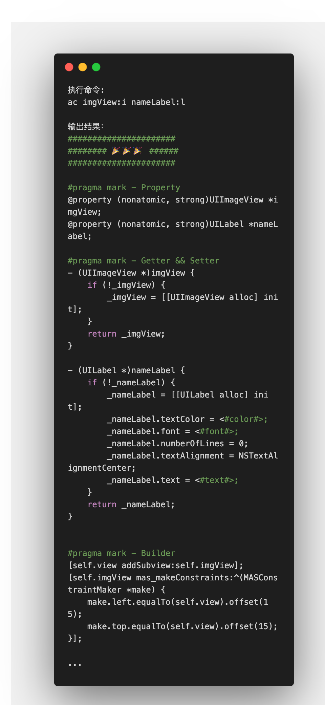

# 代码工厂


## AutomaticCode
```
生成简易 OC 视图代码(@property, getter, AutoLayout)
```



```
参数描述:
    viewName:ViewType:layoutType
    视图名称:视图类型:布局类型

    e.g. nameLabel:UILabel

    e.g. nameLabel:UILabel:e
        (e: make.edges (支持五种布局方式e/t/l/a/s), 详情可查看`内置布局`)

    e.g. nameLabel:l
        (l 是UILabel的简写)

    e.g. :l
        (省略的名称默认为类型去掉'UI'前缀,此处结果是`lable`)

    e.g. nameLabel:i nextButton:b numberText:t:a
        (支持同时生成生成多个视图)

内置布局：
    default: (left + top)
    e: edge
    t: top
    l: left
    a: all (top + left + bottom + right)
    s: size（left + top + width + height）

自定义布局：
    类型1,值1/类型2,值2
    e.g. w,200/h,100
        (设置布局宽度200，高度100)

    e.g. lt,20/r,15
        (设置视图左侧和顶部相对于父视图为20,右侧视图相对于父视图为15)

    e.g. L,20/T,15
        (设置左侧相对于上一个视图间距20，顶部视图相距于上一个视图间距15)
        (上一个视图指执行脚本时的上一个)

其他参数：
    -view: 视图添加在UIView上，默认添加在UIViewController上
```

### 运行
1. 可以使用`python3 xxx.py`运行

```
python3 ./AutomaticCode.py imgView:i nameLabel:l
```
2. 可以使用`./xxx.py`运行

```Shell
# 首先需要给xxx.py设置执行权限 
chmod 777 ./xxx.py

# 执行
./AutomaticCode.py imgView:i nameLabel:l
```

3. shell alias 执行

```Shell
# 以别名的形式运行

#alias alias_name='you code'
alias ac='python3 /xxx/AutomaticCode.py'

# 执行
ac imgView:i nameLabel:l
```


## XcodeFileTemplate
Xcode文件模板快速导入


### 使用

```Shell
# 复制仓库
git clone https://github.com/515783034/factory.git

# 切换到路径
cd ./factory/XcodeFileTemplate

# 设置执行权限
chmod 777 ./templateInject.sh

# 根据自身情况修改当前文件夹下模板内容

# 执行脚本，注入模板
#（原模板会备份在当前文件夹）
```